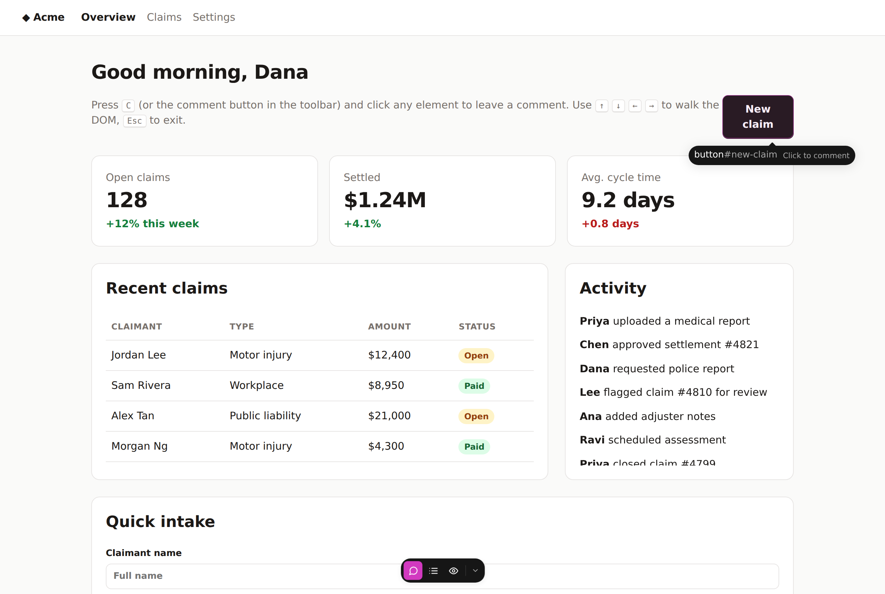
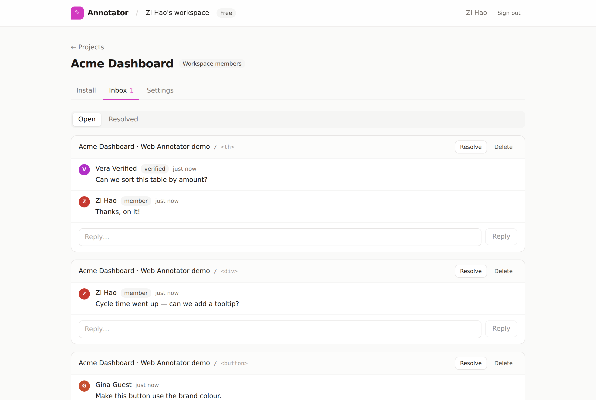
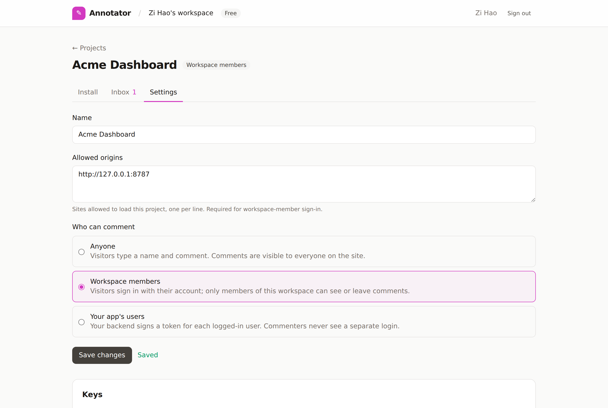

# web-annotator

Hosted, multi-tenant commenting for any website. Your customers sign up, create a project, and paste one `<script>` tag into their site. Their reviewers can then hover any element, click it, and leave a threaded comment pinned to that element.

The in-page UX follows [react-grab](https://github.com/aidenybai/react-grab):
- a magenta highlight that glides with the cursor;
- a `tag.class` badge;
- a label that grows into a comment box, with a "Discard?" confirmation;
- a draggable toolbar that snaps to screen edges.

```html
<script src="https://annotator.example.com/script.js" data-project="pk_…" defer></script>
```

| On the customer's site | Dashboard inbox | Project settings |
|---|---|---|
|  |  |  |

## Stack

| Layer | Tech |
|---|---|
| API | Cloudflare Worker: a plain `export default { fetch }` handler with a tiny `URLPattern` router (no framework) |
| Storage | Cloudflare D1, with [Drizzle ORM](https://orm.drizzle.team) for schema and migrations. One database; every row is scoped to a workspace |
| Auth | [Clerk](https://clerk.com) for site owners. Clerk Organizations are the workspaces, so invites and roles come from Clerk's UI |
| Widget | Preact and Tailwind v4, rendered in a shadow root and bundled by **Bun** into one IIFE (`script.js`, ~31 KB gzipped) |
| Dashboard | Preact and Tailwind, served from the same Worker at `/app` |
| Tooling | Bun (package manager, bundler, tests), Wrangler (dev server and deploy) |

## Tenancy model

```
Clerk organization  ─┐
  (or a user's       ├─► workspace ──► projects ──► threads ──► comments
   personal account) ┘     plan          publicKey     page URL
                           limits        identitySecret element anchor
                                         commentMode
                                         allowedOrigins
```

- **Workspace:** the tenant.
  - When someone uses the dashboard with an active Clerk organization, that organization is the workspace.
  - With no active organization, they get a personal workspace.
  - Members and roles live in Clerk: `org:admin` maps to admin, everything else to member.
  - The workspace row is created lazily on first use.
- **Project:** one site, with a publishable key for the script tag and an identity secret for verified mode. `allowedOrigins` restricts which sites can load it.
- **Isolation:**
  - Every dashboard query is scoped to the caller's workspace, so another workspace's project id returns 404.
  - Widget routes are addressed by the publishable key and checked against the project's origin allow-list.
- **Roles:**
  - Admins create, configure and delete projects, see the identity secret, rotate keys and delete threads.
  - Members can read the inbox, reply, and resolve threads.

### Who can comment

Each project chooses one of three comment modes.

| Mode | Dashboard label | Who can read | How commenters sign in |
|---|---|---|---|
| `guests` | Anyone | Everyone on an allowed origin | Type a name with the first comment |
| `members` | Workspace members | Signed-in workspace members only | A popup on the annotator's domain signs them in with Clerk and checks membership. It then posts a widget session back to the site, and only to an allow-listed origin |
| `verified` | Your app's users | Identified users only | The customer's backend signs a short-lived HS256 JWT with the project's identity secret. The widget swaps it for a session (`WebAnnotatorConfig.userToken` or `WebAnnotator.identify(token)`) |

In every mode the widget ends up holding a **widget session token**: an HS256 JWT bound to one project, valid for 30 days. Every write sends it, and ownership checks (edit or delete your own comment) use the identity inside it. Switching a project's mode invalidates sessions issued under the old mode.

`members` mode requires at least one allowed origin. Without one, any site could open the popup and receive a signed-in member's session.

### Plans and limits

`src/worker/plans.ts` defines the plans. Limits are enforced server-side, and the dashboard shows usage meters.

| Plan | Projects | Comments per month |
|---|---|---|
| Free | 2 | 500 |
| Pro | 20 | 10,000 |
| Business | 200 | 200,000 |

Billing isn't wired up yet. As the platform operator, you set plans yourself:

```bash
curl -X PATCH https://<worker>/api/admin/workspaces/org_123 \
  -H "authorization: Bearer $ADMIN_TOKEN" -H "content-type: application/json" -d '{"plan":"pro"}'
curl https://<worker>/api/admin/workspaces -H "authorization: Bearer $ADMIN_TOKEN"   # list + usage
```

Widget sign-ins and writes are rate-limited per (project, IP) by the Workers Rate Limiting binding (`ratelimits` in `wrangler.jsonc`, 60 requests/minute).

## Using the widget

Press **C**, or click the comment button in the toolbar, then click any element.

| Key | Action |
|---|---|
| `C` | Toggle comment mode (ignored while typing in inputs) |
| hover and click | Comment on the element under the cursor |
| `↑` / `↓` | Walk to the parent / back to the child |
| `←` / `→` | Previous / next sibling |
| `Enter` | Comment on the keyboard-selected element; submit the composer |
| `Shift+Enter` | New line in the composer |
| `Cmd/Ctrl`+click | Comment and stay in comment mode |
| `Esc` | Cancel. With a draft, asks "Discard?" first |

**Pins and threads**
- Pins mark open threads. Hover a pin for a preview; click it to open the thread.
- In a thread you can reply, resolve or reopen, edit or delete your own comments, and delete threads you started.

**Toolbar**
- The list button shows the page's threads (open or resolved) and who you're signed in as.
- The eye button hides or shows pins.
- The toolbar can be dragged to any edge and collapsed.

| Script attribute | Default | Meaning |
|---|---|---|
| `data-project` | required | The project's publishable key |
| `data-api` | origin of `script.js` | Base URL of the Worker, if it's not the origin serving the script |
| `data-hotkey` | `c` | Toggle key. Set `""` to disable |
| `data-url-mode` | `path` | How a "page" is identified: `path`, `hash` (hash routers), or `full` (+ query) |
| `data-theme` | `auto` | Force `light` or `dark` panels (auto = the opposite of the host app's theme) |
| `data-user-token` | — | Verified mode: a user token signed by the customer's backend |

You can set the same options in `window.WebAnnotatorConfig` before the script loads. `window.WebAnnotator` exposes `open()`, `close()`, `reload()`, `identify(token)`, `signOut()` and `destroy()`. Add `data-annotator-ignore` to any element to make it, and everything inside it, unselectable.

**How comments re-find their element:**
- Each thread stores a unique CSS selector (react-grab-style ranked search), a structural `nth-child` path, the tag name, a text snippet and the click offset.
- On load, the widget tries them in that order.
- A `MutationObserver` re-anchors pins when the DOM changes, and the widget reloads threads on SPA navigation.
- Threads whose element is gone are flagged "element not found".

**Handing feedback to a coding agent:**
- When a thread is created, the widget also captures the element's context: a trimmed HTML snippet (deep children collapsed, `on*` handlers dropped, password and hidden input values redacted), its nearest ancestors, a few computed styles, its rendered size, and the viewport and user agent.
- In dev builds it also records the framework component chain and source file: React fibers (`_debugSource`), Vue (`__file`) and Svelte (`__svelte_meta`).
- **Copy for agent** turns a thread into Markdown an agent can act on: the comments, the component and `file:line`, the selector, the HTML and the styles. The button is on each dashboard thread and in the widget's thread popover. **Copy all for agent** in the inbox does the same for every listed thread.
- `src/shared/prompt.ts` builds the prompt. Threads created before this feature have `context: null` and only include their selector.

## Development

```bash
bun install
cp .dev.vars.example .dev.vars      # DEV_AUTH=true: no Clerk account needed locally
bun run dev                         # build, migrate + seed local D1, watch assets, wrangler dev
```

- <http://127.0.0.1:8787/app/> is the dashboard. With `DEV_AUTH=true` and no Clerk keys, you sign in by typing a user id, plus an optional organization. Dev sessions are unsigned and **accepted only on localhost**.
- <http://127.0.0.1:8787/> is the demo page. It embeds the seeded `pk_demo` project, which is in guests mode.

To use real Clerk locally, set `CLERK_PUBLISHABLE_KEY` and `CLERK_SECRET_KEY` in `.dev.vars`. Setting them disables dev auth.

```bash
bun test              # API (bun:sqlite + real migrations), Clerk verification, build tests
bun run typecheck
bun e2e/smoke.ts      # Chromium end-to-end run against `bun run dev`; screenshots in e2e/screenshots/
```

The e2e run covers:
- dashboard sign-in and project creation;
- the guest flow on the demo page;
- switching to members mode, then the sign-in popup and posting;
- switching to verified mode with a backend-signed token;
- the dashboard inbox and replying.

### Layout

```
src/
  shared/                  wire types + dev-token helpers shared by all three bundles
  worker/
    index.ts               Worker entry: env → providers, API first then static assets
    app.ts                 router composition, CORS (widget routes only)
    auth/identity.ts       Clerk session verification (JWKS or PEM) + Backend API; dev provider
    auth/tokens.ts         widget session tokens, customer-signed user tokens, key generation
    routes/widget.ts       /api/w/:publicKey/*: config, sign-in per mode, threads, comments
    routes/dashboard.ts    /api/dashboard/*: workspace, projects, keys, inbox (Clerk session)
    routes/admin.ts        /api/admin/*: plans and usage (ADMIN_TOKEN)
    services.ts            thread/comment operations + quota checks
    plans.ts               plan limits
    db/schema.ts           workspaces, projects, threads, comments
  widget/                  embeddable script (store, sign-in flows, picker, pins, panels)
  dashboard/               dashboard SPA (main.tsx) + member sign-in popup (widget-auth.tsx)
scripts/build.ts           Tailwind → shadow-DOM-safe CSS → Bun.build for widget + dashboard
drizzle/                   SQL migrations (applied by wrangler d1 migrations)
```

After changing `src/worker/db/schema.ts`, run `bun run db:generate` and commit the new file in `drizzle/`.

## Deploying (hosting it for others)

1. **Clerk.** Create an application at <https://dashboard.clerk.com> and enable **Organizations** (with personal accounts allowed). Add your Worker's domain to the allowed origins for production instances.
2. **D1.** Run `bunx wrangler d1 create web-annotator` and paste the `database_id` into `wrangler.jsonc`.
3. **Config.** Set `vars.CLERK_PUBLISHABLE_KEY` in `wrangler.jsonc`, then add the secrets:
   ```bash
   bunx wrangler secret put CLERK_SECRET_KEY
   bunx wrangler secret put WIDGET_TOKEN_SECRET     # long random string, e.g. openssl rand -base64 48
   bunx wrangler secret put ADMIN_TOKEN             # for /api/admin/*
   # optional: CLERK_JWT_KEY (PEM) for networkless token verification,
   #           CLERK_AUTHORIZED_PARTIES if the dashboard is served from another origin
   ```
4. **Deploy.** Run `bun run deploy`. It builds, applies remote migrations and deploys the Worker.
5. **Point people at it.** Customers sign up at `https://<your-domain>/app/`. `script.js` is served from the same domain.

**Never set `DEV_AUTH` in production.** It is also ignored whenever Clerk keys are present, and it only works on localhost.

## API

**Widget** (`/api/w/:publicKey/…`): CORS-enabled and checked against the origin allow-list. Send `Authorization: Bearer <widget token>` once signed in.

| Method | Path | Notes |
|---|---|---|
| `GET` | `/config` | Project name, comment mode, sign-in URL |
| `POST` | `/session/guest` | `{ name, token? }` (guests mode) |
| `POST` | `/session/verified` | `{ token }`: customer-signed JWT (verified mode) |
| `POST` | `/session/member` | `{ origin }` + Clerk session. Only from the annotator's own sign-in page (members mode) |
| `GET` | `/threads?url=&status=` | Public in guests mode; needs a session otherwise |
| `POST` | `/threads` | `{ pageUrl, pageTitle?, anchor, body }` |
| `PATCH` / `DELETE` | `/threads/:id` | Resolve/reopen; delete (thread author only) |
| `POST` | `/threads/:id/comments` | `{ body }` |
| `PATCH` / `DELETE` | `/threads/:id/comments/:cid` | Comment author only. Deleting the last comment deletes the thread |

**Dashboard** (`/api/dashboard/…`): same-origin only, `Authorization: Bearer <Clerk session token>`.

- `GET /workspace` returns the workspace, plan and usage.
- `/projects` (`GET`, `POST`) and `/projects/:id` (`GET`, `PATCH`, `DELETE`).
- `POST /projects/:id/rotate` with `{ key: "publicKey" | "identitySecret" }`.
- Inbox:
  - `GET /projects/:id/threads?status=`
  - `PATCH` / `DELETE /projects/:id/threads/:tid`
  - `POST /projects/:id/threads/:tid/comments`
  - `DELETE /projects/:id/threads/:tid/comments/:cid` (admin moderation)

**Admin** (`/api/admin/…`), with `Authorization: Bearer $ADMIN_TOKEN`: `GET /workspaces` and `PATCH /workspaces/:id` with `{ plan }`.

Errors look like `{ error, code? }`. The codes are `auth_required`, `origin_not_allowed`, `quota_exceeded`, `rate_limited`, `admin_required`, `not_a_member` and `invalid_user_token`.

## Limitations and next steps

- **Billing:** plans are set manually. Next step: Stripe Checkout plus a webhook calling the same plan update.
- **Members per workspace** aren't limited, because membership lives in Clerk. That would need a Clerk webhook.
- **No real-time updates:** new comments appear on reload or navigation. Durable Objects or WebSockets would fix that.
- **No notifications:** no email or Slack alerts for new comments or replies yet.
- **Identity secrets** are stored as-is in D1. Consider encrypting them at rest with a Worker-held key.
- **Not supported yet:** content inside iframes or other shadow roots, and multi-element drag selection.
