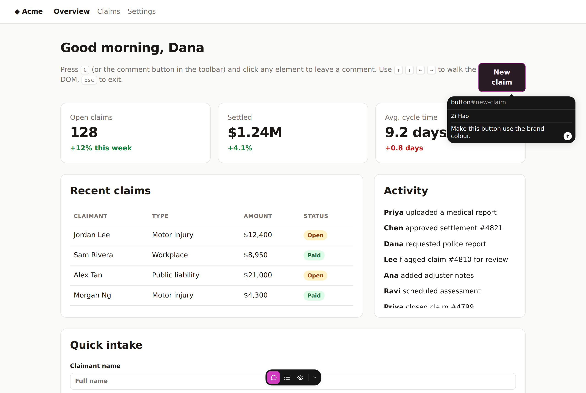
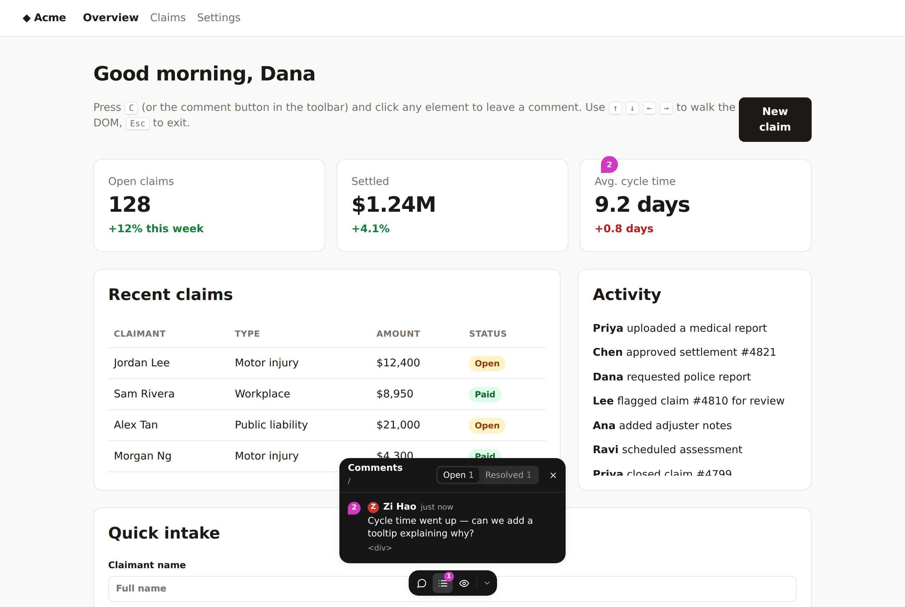

# web-annotator

Drop-in commenting for any web app. Add one `<script>` tag. Reviewers can then hover any element, click it, and leave a threaded comment pinned to that element. The UX follows [react-grab](https://github.com/aidenybai/react-grab), including:

- a magenta highlight that glides with the cursor;
- a `tag.class` badge;
- a label that grows into a composer;
- "Discard?" confirmation;
- a draggable toolbar that snaps to screen edges.

```html
<script src="https://annotator.example.com/script.js" data-project="acme" defer></script>
```

| Hover | Compose | Page comments |
|---|---|---|
|  |  |  |

## Stack

| Layer | Tech |
|---|---|
| API | Cloudflare Worker: a plain `export default { fetch }` handler with a tiny `URLPattern` router (no framework) |
| Storage | Cloudflare D1, with [Drizzle ORM](https://orm.drizzle.team) for schema and migrations |
| Widget | Preact and Tailwind CSS v4, rendered in a shadow root and bundled by **Bun** into a single IIFE (`script.js`, ~29 KB gzipped, CSS inlined) |
| Tooling | Bun (package manager, bundler, test runner), Wrangler (dev server and deploy) |

The same Worker serves the API (`/api/*`) and the static `script.js` (Workers Static Assets). Customers only need one origin.

## Using it

Press **C**, or click the comment button in the toolbar, then click any element.

| Key | Action |
|---|---|
| `C` | Toggle comment mode (ignored while typing in inputs) |
| hover and click | Comment on the element under the cursor |
| `↑` / `↓` | Walk to the parent / back to the child |
| `←` / `→` | Previous / next sibling |
| `Enter` | Comment on the keyboard-selected element; submit the composer |
| `Shift+Enter` | New line in the composer |
| `Cmd/Ctrl`+click | Comment and stay in comment mode |
| `Esc` | Cancel. With a draft, asks "Discard?" first; `Enter` or `Esc` again confirms |

**Pins and threads**
- Pins mark every open thread. Hover a pin for a preview; click it to open the thread.
- In a thread you can reply, resolve or reopen, edit or delete your own comments, and delete threads you started.

**Toolbar**
- The list button shows every thread on the page (open or resolved). Clicking a thread scrolls to its element.
- The eye button hides or shows pins.
- Drag the toolbar to any screen edge. Its velocity is projected, as in react-grab. The chevron collapses it to a small tab.

**Identity and theme**
- The first comment asks for a display name. Name and an anonymous author id are kept in `localStorage`; there is no login (see [Limitations](#limitations)).
- Panels use the inverse of the host app's theme: dark panels on light apps, light panels on dark apps.

### Script tag options

| Attribute | Default | Meaning |
|---|---|---|
| `data-project` | required | Project id that comments are stored under |
| `data-api` | origin of `script.js` | Base URL of the Worker, if it's not the origin serving the script |
| `data-hotkey` | `c` | Toggle key. Set `""` to disable |
| `data-url-mode` | `path` | How a "page" is identified: `path` (origin + pathname), `hash` (+ `#hash`, for hash routers), `full` (+ query + hash) |
| `data-theme` | `auto` | Force `light` or `dark` panels |

You can also set `window.WebAnnotatorConfig = { projectId, apiBase, ... }` before the script loads. At runtime, `window.WebAnnotator` exposes `open()`, `close()`, `reload()` and `destroy()`.

Add `data-annotator-ignore` to any element to make it, and everything inside it, unselectable.

## How elements are re-found

Each thread stores an anchor:
- `selector`: the shortest unique CSS selector. It prefers a stable `#id`, then `data-testid` and similar attributes, then a penalty-ranked walk through ancestors that skips hashed or utility class names. This approach is borrowed from react-grab's selector finder.
- `domPath`: a structural `nth-child` path.
- the tag name and a text snippet.
- the click offset within the element.

On load, the widget tries the selector first, then the structural path (checked against the tag name and text), then a text match. A `MutationObserver` re-anchors pins as the DOM changes. Threads whose element is gone stay in the list, marked "element not found". The widget also re-fetches threads on SPA navigation (`pushState`, `popstate`, `hashchange`).

## Development

```bash
bun install
cp .dev.vars.example .dev.vars      # sets ADMIN_TOKEN for local project creation
bun run dev                         # builds widget, migrates + seeds local D1, runs widget watcher + wrangler dev
```

Open <http://127.0.0.1:8787>. The demo page (`demo/index.html`) embeds the widget with `data-project="demo"`.

```bash
bun test              # API tests (handlers run against bun:sqlite with the real migrations) + build tests
bun run typecheck
bun e2e/smoke.ts      # Chromium end-to-end run against `bun run dev`; screenshots in e2e/screenshots/
```

The e2e script creates a scratch project for each run using `ADMIN_TOKEN` (default `dev-admin`). It uses Playwright's Chromium. Set `CHROMIUM_PATH` if it isn't at `/opt/pw-browsers/chromium`.

### Layout

```
src/
  shared/api.ts          wire types shared by API and widget
  worker/
    index.ts             Worker entry: API first, then static assets
    app.ts               routes + handlers (framework-free)
    http.ts              Router, JSON/error helpers
    validation.ts        zod request schemas
    db/schema.ts         Drizzle schema (projects, threads, comments)
  widget/
    index.tsx            script entry: reads <script> data-*, mounts shadow root
    store.ts             signals state + actions
    api.ts               fetch client
    lib/                 selector/anchoring, hit-testing, theme detection, geometry
    ui/                  Toolbar, Picker (shield + hover label), Overlay (canvas),
                         SelectionPanel (composer), Pins, ThreadPopover, ThreadList
    styles.css           Tailwind v4 entry + react-grab design tokens
scripts/build-widget.ts  Tailwind → shadow-DOM-safe CSS → Bun.build IIFE → dist/public
drizzle/                 generated SQL migrations (applied by wrangler d1 migrations)
```

After changing `src/worker/db/schema.ts`, run `bun run db:generate` and commit the new file in `drizzle/`.

### Tailwind inside a shadow root

Tailwind v4 relies on `@property` for internal variables such as `--tw-shadow`, and `@property` is ignored inside shadow roots. The build therefore unwraps Tailwind's own `*`-selector fallback (see `scripts/build-widget-lib.ts`). With that change, shadows, rings and transforms work inside the widget.

## Deploying

```bash
bunx wrangler login
bunx wrangler d1 create web-annotator          # paste the database_id into wrangler.jsonc
bunx wrangler secret put ADMIN_TOKEN
bun run deploy                                  # build widget, apply remote migrations, deploy Worker
```

Create a project for each site. `allowedOrigins` restricts which origins may read or write comments; an empty list allows any origin.

```bash
curl -X POST https://<worker>/api/projects \
  -H "authorization: Bearer $ADMIN_TOKEN" -H "content-type: application/json" \
  -d '{"id":"acme","name":"Acme app","allowedOrigins":["https://app.acme.com","https://staging.acme.com"]}'
```

## API

All routes are under `/api/projects/:projectId`. Each one checks the project's origin allow-list and sends CORS headers.

| Method | Path | Body |
|---|---|---|
| `GET` | `/threads?url=&status=` | — |
| `POST` | `/threads` | `{ pageUrl, pageTitle?, anchor, body, author: { id, name } }` |
| `GET` | `/threads/:id` | — |
| `PATCH` | `/threads/:id` | `{ status: "open" \| "resolved" }` |
| `DELETE` | `/threads/:id` | header `x-annotator-author-id` (thread author only) |
| `POST` | `/threads/:id/comments` | `{ body, author }` |
| `PATCH` | `/threads/:id/comments/:cid` | `{ body }` + `x-annotator-author-id` (comment author only) |
| `DELETE` | `/threads/:id/comments/:cid` | `x-annotator-author-id`. Deleting the last comment also deletes the thread |

There is also `POST /api/projects`, which needs `Authorization: Bearer $ADMIN_TOKEN`, and `GET /api/health`.

## Limitations

- **No real authentication.** Authors are self-named, and "ownership" for edits and deletes is an anonymous id in `localStorage`. The origin allow-list stops other websites' browsers from using a project. It does not stop someone with curl. Before using this outside trusted review environments, put the API behind real auth: Cloudflare Access, signed tokens from the host app, or similar.
- There is no rate limiting yet. Consider Cloudflare rate-limiting rules on `/api/*`.
- There is no real-time sync. Other people's comments appear on reload or SPA navigation.
- Content inside iframes and other shadow roots can't be annotated yet. Neither can multi-element (drag) selections, which react-grab supports.
